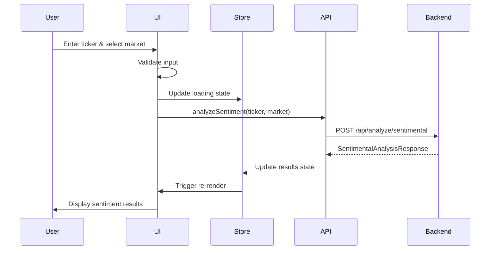
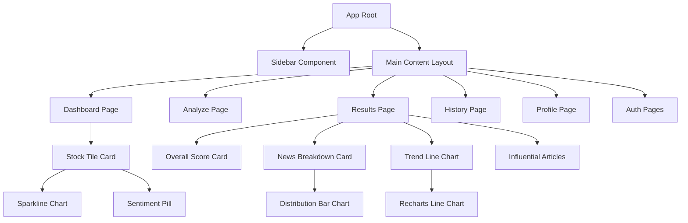
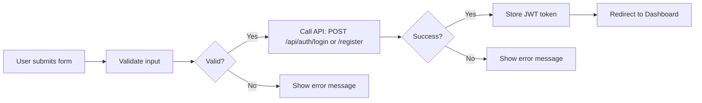
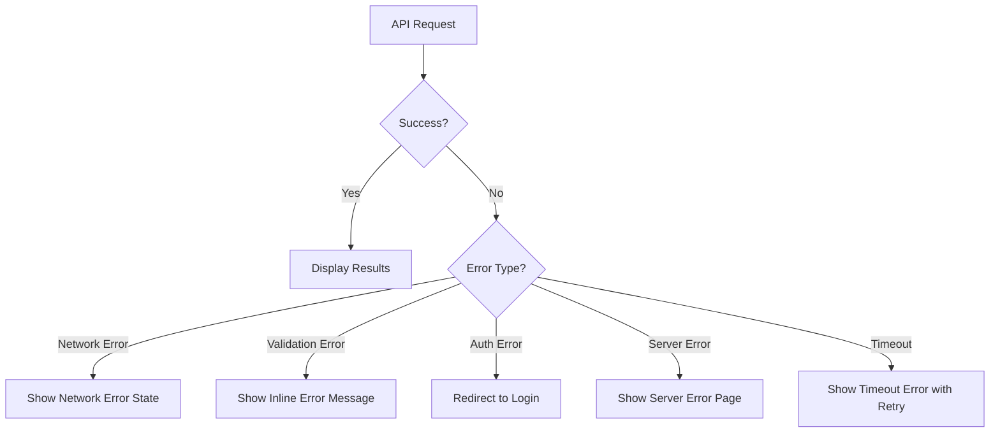
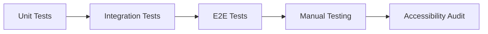

# Sentiment Analysis Module - Frontend Implementation Plan

## Executive Summary

This document provides a comprehensive, sequential task list for implementing the frontend of the Sentiment Analysis module for the FinEdge Market Intelligence platform. The plan strictly focuses on frontend development with zero scope creep into backend implementation.

## System Architecture Overview

```mermaid
graph TB
    subgraph "Frontend Layer - Next.js 14.x"
        A[User Interface] --> B[Components Library]
        A --> C[Pages & Routes]
        B --> D[Design System]
        C --> E[State Management - Zustand]
        E --> F[API Client - Axios]
    end
    
    subgraph "Backend Layer - FastAPI"
        F --> G[POST /api/analyze/sentimental]
        F --> H[GET /api/user/history]
        F --> I[DELETE /api/user/history/{id}]
        F --> J[POST /api/auth/*]
    end
    
    G --> K[Sentimental Engine]
    H --> L[Database]
    I --> L
    J --> M[Auth Service]
```

## Data Flow Diagram



## Component Hierarchy



## Task Breakdown by Phase

### Phase 1: Project Setup & Foundation (6 tasks)
**Goal:** Establish the Next.js project structure with all necessary dependencies and configuration.

**Key Deliverables:**
- Next.js 14.x project with TypeScript and App Router
- Tailwind CSS configured with custom design system
- Base directory structure (app/, components/, lib/, types/)
- Environment variables for API base URL
- ESLint and Prettier configuration

**Dependencies to Install:**
```bash
npm install next@14 react@18 react-dom@18 typescript @types/react @types/node
npm install tailwindcss postcss autoprefixer
npm install recharts axios zustand react-hook-form zod date-fns
npm install jspdf @types/jspdf
npm install @tanstack/react-query
```

---

### Phase 2: Design System Implementation (7 tasks)
**Goal:** Implement the visual design system with reusable components matching the specified aesthetic.

**Design System Specifications:**

| Element | Value | Usage |
|---------|-------|-------|
| Primary Blue | `#2563EB` | Primary buttons, Logo icon |
| Sidebar Navy | `#0F172A` / `#020617` | Sidebar background |
| Main BG | `#F8FAFC` | Main content background |
| Card White | `#FFFFFF` | Card backgrounds |
| Success Green | `#10B981` | Positive sentiment, bullish signals |
| Text Dark | `#1E293B` | Headings, prices, symbols |
| Text Light | `#64748B` | Labels, metadata |
| Border | `#E2E8F0` | Dividers, borders |
| Alert Red | `#EF4444` | Negative sentiment, alerts |

**Typography:**
- Font Family: Inter or SF Pro Display
- Weights: 400 (Regular), 500 (Medium), 600 (Semi-Bold), 700 (Bold)

**Components to Create:**
1. **Button** - Primary (Blue solid), Secondary (White with grey border)
2. **Card** - 12px border-radius, subtle shadow, 24px padding
3. **Tag/Pill** - Exchange tags, Sector tags, Sentiment pills
4. **Input** - With validation states and error messages
5. **Skeleton** - Loading states for various UI elements

---

### Phase 3: Layout & Navigation (6 tasks)
**Goal:** Build the global layout structure with sidebar navigation and responsive design.

**Layout Specifications:**
- Two-column layout
- Sidebar: Fixed 260px width, full height, dark navy background
- Main Content: Fluid right side, 32px padding, off-white background

**Sidebar Components:**
1. Logo area with "FinEdge" text and blue gradient icon
2. Navigation menu with active/inactive states
3. Footer area with Alerts badge (Red #EF4444), Settings, Dark Mode toggle

**Responsive Behavior:**
- Desktop (>1024px): Full sidebar visible
- Tablet (640-1024px): Collapsible sidebar
- Mobile (<640px): Hamburger menu with slide-out drawer

---

### Phase 4: API Client & State Management (7 tasks)
**Goal:** Implement API communication and state management for the application.

**API Client Structure:**
```typescript
// lib/api.ts
- axios instance with base URL
- request interceptor (add JWT token)
- response interceptor (handle errors, refresh token)
- error handling utility
```

**API Service Functions:**
```typescript
// lib/services/sentimentService.ts
- analyzeSentiment(ticker: string, market: 'US' | 'IN'): Promise<SentimentalAnalysisResponse>
- getAnalysisHistory(): Promise<AnalysisHistory[]>
- deleteAnalysis(id: string): Promise<void>
```

**State Management (Zustand):**
```typescript
// stores/authStore.ts
- user session
- JWT token
- authentication status

// stores/sentimentStore.ts
- analysis state (idle, loading, success, error)
- analysis results
- loading progress
- error messages

// stores/uiStore.ts
- theme (light/dark)
- sidebar state (open/closed)
```

**Type Definitions:**
```typescript
// types/sentiment.ts
interface SentimentalAnalysisRequest {
  ticker: string;
  market: 'US' | 'IN';
}

interface SentimentalAnalysisResponse {
  ticker: string;
  market: string;
  overall_sentiment: 'Positive' | 'Negative' | 'Neutral';
  score: number; // -1 to 1
  news_breakdown: NewsBreakdown;
  trend: 'Improving' | 'Declining' | 'Stable';
  confidence: number; // 0 to 1
  analysis_summary: string;
  influential_articles: InfluentialArticle[];
  cached: boolean;
  analyzed_at: string;
}
```

---

### Phase 5: Authentication Pages (6 tasks)
**Goal:** Create user authentication flow with login and signup pages.

**Pages to Create:**
1. **Login Page** (`app/(auth)/login/page.tsx`)
   - Email and password inputs
   - Form validation using react-hook-form and zod
   - "Remember me" checkbox
   - "Forgot password" link
   - Link to signup page

2. **Signup Page** (`app/(auth)/signup/page.tsx`)
   - Full name, email, password, confirm password inputs
   - Form validation
   - Link to login page

**Authentication Flow:**


---

### Phase 6: Dashboard Page (7 tasks)
**Goal:** Create the main dashboard with stock tiles displaying sentiment analysis results.

**Dashboard Features:**
- Responsive grid layout: `grid-template-columns: repeat(auto-fill, minmax(300px, 1fr))`
- Gap: 24px

**Stock Tile Component Structure:**
```tsx
<StockTile>
  <Header>
    <Symbol>AAPL</Symbol>
    <ExchangeTag>NASDAQ</ExchangeTag>
  </Header>
  <PriceSection>
    <Price>$178.50</Price>
    <PercentageChange>+1.85%</PercentageChange>
  </PriceSection>
  <SparklineChart />
  <DataGrid>
    <Volume>45.2M</Volume>
    <PERatio>28.5</PERatio>
  </DataGrid>
  <Indicators>
    <SentimentPill>Positive</SentimentPill>
    <TechnicalPill>BUY</TechnicalPill>
  </Indicators>
  <Actions>
    <ReAnalyzeButton />
    <PaperTradeButton />
  </Actions>
</StockTile>
```

**Sparkline Chart:**
- Use Recharts LineChart
- Green line for positive trend
- Smooth curve styling
- Minimal axis (no labels)

---

### Phase 7: Sentiment Analysis Input Page (7 tasks)
**Goal:** Create the analyze page where users input ticker and select market for analysis.

**Page Structure:**
```tsx
<AnalyzePage>
  <SearchSection>
    <TickerInput placeholder="Enter ticker symbol (e.g., AAPL)" />
    <MarketToggle>
      <Option>US Market</Option>
      <Option>IN Market</Option>
    </MarketToggle>
    <AnalyzeButton>Analyze</AnalyzeButton>
  </SearchSection>
  <RecentAnalyses>
    <AnalysisCard />
    <AnalysisCard />
  </RecentAnalyses>
</AnalyzePage>
```

**Features:**
- Real-time ticker search with debounce (300ms)
- Market toggle switch with visual feedback
- Form validation (1-20 characters for ticker)
- Recent analyses quick-select
- Error handling for invalid ticker symbols

---

### Phase 8: Sentiment Analysis Results Page (7 tasks)
**Goal:** Display comprehensive sentiment analysis results with visualizations.

**Results Page Layout:**
```
┌─────────────────────────────────────────────────┐
│ Header: AAPL | NASDAQ | Analyzed at: 2024-01-24 │
├─────────────────────────────────────────────────┤
│ Overall Score Card                               │
│ ┌─────────────────────────────────────────────┐ │
│ │ Score: 0.452                                │ │
│ │ Verdict: BUY (Green Badge)                  │ │
│ │ Confidence: 78% [████████░░░░░░░░░]         │ │
│ │ Trend: Improving ↑                          │ │
│ └─────────────────────────────────────────────┘ │
├─────────────────────────────────────────────────┤
│ Analysis Summary                                │
│ "Based on 10 news articles, sentiment is       │
│ Positive with an average score of 0.452..."    │
├─────────────────────────────────────────────────┤
│ Cached Indicator (if applicable)                │
└─────────────────────────────────────────────────┘
```

**Components:**
1. **Overall Score Card** - Large score display (-1 to 1 scale)
2. **Sentiment Verdict** - BUY/SELL/HOLD badge with color coding
3. **Confidence Score** - Progress bar (0-1 scale)
4. **Trend Indicator** - Improving/Declining/Stable with arrow icon
5. **Analysis Summary** - Formatted text component
6. **Cached Indicator** - Badge showing if results from cache

---

### Phase 9: News Breakdown Section (7 tasks)
**Goal:** Display detailed news sentiment breakdown with statistics and article lists.

**News Breakdown Card:**
```
┌─────────────────────────────────────────────────┐
│ News Breakdown                                   │
├─────────────────────────────────────────────────┤
│ Total Articles: 10                              │
│                                                  │
│ Sentiment Distribution:                          │
│ ████████████████████░░░░░░░░░░░░░░░░░░░░░░░░░   │
│ Positive: 6 | Negative: 2 | Neutral: 2          │
│                                                  │
│ Average Score: 0.452                             │
├─────────────────────────────────────────────────┤
│ Top Positive Articles                            │
│ • Apple Reports Record Q4 Earnings              │
│   Score: 0.85 | Verdict: BUY | Source: Reuters  │
│                                                  │
│ Top Negative Articles                            │
│ • Apple Faces Supply Chain Issues                │
│   Score: -0.65 | Verdict: SELL | Source: CNBC   │
└─────────────────────────────────────────────────┘
```

**Components:**
1. **Article Count Statistics** - Total, positive, negative, neutral
2. **Sentiment Distribution Bar Chart** - Visual breakdown using Recharts
3. **Average Score Display** - With visual indicator
4. **Top Positive Articles List** - Expandable cards with details
5. **Top Negative Articles List** - Expandable cards with details
6. **Expandable Article Details** - Reasoning, URL link
7. **Empty State** - For no articles found

---

### Phase 10: Trend Visualization (7 tasks)
**Goal:** Create an interactive sentiment trend chart showing sentiment over time.

**Trend Chart Features:**
- Line chart using Recharts
- Time-based data points (last 7 days)
- Interactive tooltips showing sentiment score per article
- Color-coded trend line (green for positive, red for negative)
- Smooth curve styling
- Chart legend and axis labels
- Empty data state handling

**Chart Configuration:**
```typescript
<LineChart data={trendData}>
  <XAxis dataKey="date" />
  <YAxis domain={[-1, 1]} />
  <Tooltip content={<CustomTooltip />} />
  <Line 
    type="monotone" 
    dataKey="score" 
    stroke="#10B981" 
    strokeWidth={2}
    dot={false}
  />
</LineChart>
```

---

### Phase 11: Influential Articles Section (7 tasks)
**Goal:** Display influential articles with detailed sentiment information.

**Influential Articles Card:**
```
┌─────────────────────────────────────────────────┐
│ Influential Articles                             │
├─────────────────────────────────────────────────┤
│ Article 1                                        │
│ ┌─────────────────────────────────────────────┐ │
│ │ Apple Reports Record Q4 Earnings              │ │
│ │ Score: 0.85 | Verdict: BUY [Green]           │ │
│ │ Source: Reuters | Published: 2 hours ago    │ │
│ │                                              │ │
│ │ Reasoning: Strong earnings beat expectations, │ │
│ │ revenue growth of 8% YoY, positive guidance  │ │
│ │ for next quarter... [Read More]              │ │
│ └─────────────────────────────────────────────┘ │
│                                                  │
│ Article 2                                        │
│ ...                                              │
└─────────────────────────────────────────────────┘
```

**Components:**
1. **Article Card** - Title, sentiment score, verdict badge
2. **Source Display** - Publication source and date
3. **Expandable Reasoning** - Formatted text with proper styling
4. **External Link** - Button to open article URL
5. **Sentiment Score Visual** - Color bar indicator
6. **Empty State** - For no influential articles

---

### Phase 12: Analysis Actions & Export (7 tasks)
**Goal:** Implement action buttons for re-analysis, saving, exporting, and sharing.

**Action Bar:**
```tsx
<ActionBar>
  <ReAnalyzeButton>Re-analyze</ReAnalyzeButton>
  <SaveToHistoryButton>Save to History</SaveToHistoryButton>
  <ExportDropdown>
    <ExportPDFButton>Export PDF</ExportPDFButton>
    <ExportCSVButton>Export CSV</ExportCSVButton>
  </ExportDropdown>
  <ShareButton>Share</ShareButton>
  <AlertButton>Set Alert</AlertButton>
</ActionBar>
```

**Features:**
1. **Re-analyze** - Triggers new analysis with same ticker/market
2. **Save to History** - Saves current analysis to user history
3. **Export PDF** - Uses jsPDF to generate PDF report
4. **Export CSV** - Exports data in CSV format
5. **Share** - Copies shareable link to clipboard
6. **Alert** - Opens modal to set price alerts

---

### Phase 13: Analysis History Page (8 tasks)
**Goal:** Create a page to view and manage past sentiment analyses.

**History Page Layout:**
```
┌─────────────────────────────────────────────────┐
│ Analysis History                                 │
│ [Search Input] [Filter Dropdown]                │
├─────────────────────────────────────────────────┤
│ History Cards (Last 50, paginated)              │
│                                                  │
│ ┌─────────────────────────────────────────────┐ │
│ │ AAPL | NASDAQ | 2024-01-24 14:30            │ │
│ │ Sentiment: Positive | Score: 0.452           │ │
│ │ [View Details] [Delete] [Cached]             │ │
│ └─────────────────────────────────────────────┘ │
│                                                  │
│ ┌─────────────────────────────────────────────┐ │
│ │ TSLA | NASDAQ | 2024-01-23 09:15            │ │
│ │ Sentiment: Negative | Score: -0.321         │ │
│ │ [View Details] [Delete] [Fresh]             │ │
│ └─────────────────────────────────────────────┘ │
│                                                  │
│ [Load More] / Pagination Controls                │
└─────────────────────────────────────────────────┘
```

**Features:**
1. **History List** - Last 50 analyses with pagination
2. **History Card** - Ticker, market, date, sentiment, score
3. **View Details** - Re-opens past analysis results
4. **Delete** - Removes history item with confirmation
5. **Pagination/Infinite Scroll** - For large history
6. **Search/Filter** - Filter by ticker, date, sentiment
7. **Empty State** - For no history
8. **Cache Indicator** - Shows if result was cached

---

### Phase 14: Profile Page (7 tasks)
**Goal:** Create user profile page with account management and settings.

**Profile Page Layout:**
```
┌─────────────────────────────────────────────────┐
│ Profile                                          │
├─────────────────────────────────────────────────┤
│ User Information                                │
│ Name: John Doe                                  │
│ Email: john@example.com                         │
│ Member Since: January 2024                      │
├─────────────────────────────────────────────────┤
│ Account Settings                                │
│ [Update Name] [Update Email]                    │
│                                                  │
│ Change Password                                 │
│ [Current Password] [New Password] [Confirm]      │
│ [Update Password]                                │
├─────────────────────────────────────────────────┤
│ Usage Statistics                                │
│ Analyses Performed: 45                          │
│ Cache Hits: 32 (71%)                            │
├─────────────────────────────────────────────────┤
│ Theme Preference                                │
│ [Light Mode] [Dark Mode]                        │
├─────────────────────────────────────────────────┤
│ Danger Zone                                     │
│ [Delete Account] [Logout]                       │
└─────────────────────────────────────────────────┘
```

**Features:**
1. **User Information Display** - Name, email, member since
2. **Account Settings Form** - Update name and email
3. **Password Change Form** - With validation
4. **Usage Statistics** - Analyses count, cache hits
5. **Theme Preference** - Light/Dark mode toggle
6. **Delete Account** - With confirmation dialog
7. **Logout** - With confirmation dialog

---

### Phase 15: Error Handling & Loading States (7 tasks)
**Goal:** Implement comprehensive error handling and loading states across the application.

**Error Handling Strategy:**


**Components to Create:**
1. **Error Boundary** - Catches React errors
2. **API Error Handler** - Centralized error handling with retry
3. **Skeleton Components** - Loading states for all major sections
4. **Progress Indicator** - For long-running analyses
5. **Timeout Handler** - Handles API timeouts (>30s)
6. **Network Error State** - With retry button
7. **Offline Detection** - Detects and handles offline state

---

### Phase 16: Responsive Design & Mobile Optimization (7 tasks)
**Goal:** Ensure the application works seamlessly across all device sizes.

**Responsive Breakpoints:**
- Mobile: <640px
- Tablet: 640-1024px
- Desktop: >1024px

**Mobile Optimizations:**
1. **Collapsible Sidebar** - Hamburger menu with slide-out drawer
2. **Optimized Stock Tiles** - Stacked layout for mobile
3. **Horizontal Scrolling** - For charts on mobile
4. **Touch-Friendly Inputs** - Proper touch targets (44px min)
5. **Stacked Results Layout** - Cards stacked vertically
6. **Testing** - Verify layout across all breakpoints

---

### Phase 17: Performance Optimization (7 tasks)
**Goal:** Optimize application performance for fast load times and smooth interactions.

**Optimization Techniques:**
1. **Code Splitting** - Lazy load pages and components
2. **React.memo** - Prevent unnecessary re-renders
3. **Virtual Scrolling** - For long lists (history, articles)
4. **Image Optimization** - Lazy loading, WebP format
5. **Debouncing** - For search inputs (300ms)
6. **Request Deduplication** - Prevent duplicate API calls
7. **Analytics Tracking** - Monitor performance metrics

---

### Phase 18: Accessibility & User Experience (7 tasks)
**Goal:** Ensure the application is accessible to all users and provides excellent UX.

**Accessibility Features:**
1. **ARIA Labels** - For all interactive elements
2. **Keyboard Navigation** - Tab, Enter, Escape support
3. **Focus States** - Visible focus indicators
4. **Screen Reader** - Announcements for dynamic content
5. **Color Contrast** - WCAG AA compliance
6. **Heading Hierarchy** - Proper h1-h6 structure
7. **Tooltips** - Help text for complex features

---

### Phase 19: Testing & Quality Assurance (7 tasks)
**Goal:** Ensure application quality through comprehensive testing.

**Testing Strategy:**


**Test Coverage:**
1. **Unit Tests** - Utility functions, API client
2. **Component Tests** - Major UI components
3. **Integration Tests** - API calls and state management
4. **E2E Tests** - Critical user flows using Playwright
5. **Browser Testing** - Chrome, Firefox, Safari
6. **Mobile Testing** - Actual mobile devices
7. **Accessibility Audit** - WCAG compliance check

---

### Phase 20: Documentation & Handoff (7 tasks)
**Goal:** Create comprehensive documentation for the frontend implementation.

**Documentation Deliverables:**
1. **Component Documentation** - Usage examples and props
2. **API Integration Docs** - Patterns and error handling
3. **Deployment Guide** - Build process and deployment steps
4. **Environment Config** - Required environment variables
5. **Troubleshooting Guide** - Common issues and solutions
6. **Code Comments** - Inline comments for complex logic
7. **User Guide** - Sentiment Analysis features

---

## API Integration Summary

### Available Endpoints

| Method | Endpoint | Description | Request | Response |
|--------|----------|-------------|---------|----------|
| POST | `/api/analyze/sentimental` | Analyze sentiment | `{ticker, market}` | `SentimentalAnalysisResponse` |
| GET | `/api/user/history` | Get analysis history | - | `AnalysisHistory[]` |
| DELETE | `/api/user/history/{id}` | Delete history item | - | Success message |
| POST | `/api/auth/login` | User login | `{email, password}` | `{token, user}` |
| POST | `/api/auth/register` | User registration | `{email, password, name}` | `{token, user}` |
| POST | `/api/auth/logout` | User logout | - | Success message |
| GET | `/api/health` | Health check | - | Health status |

### Request/Response Types

```typescript
// SentimentalAnalysisRequest
interface SentimentalAnalysisRequest {
  ticker: string; // 1-20 characters
  market: 'US' | 'IN';
}

// SentimentalAnalysisResponse
interface SentimentalAnalysisResponse {
  ticker: string;
  market: string;
  overall_sentiment: 'Positive' | 'Negative' | 'Neutral';
  score: number; // -1 to 1
  news_breakdown: {
    ticker: string;
    article_count: number;
    positive_count: number;
    negative_count: number;
    neutral_count: number;
    average_score: number;
    top_positive_articles: Array<{
      title: string;
      score: number;
      verdict: 'BUY' | 'SELL' | 'HOLD';
      source: string;
    }>;
    top_negative_articles: Array<{
      title: string;
      score: number;
      verdict: 'BUY' | 'SELL' | 'HOLD';
      source: string;
    }>;
  };
  trend: 'Improving' | 'Declining' | 'Stable';
  confidence: number; // 0 to 1
  analysis_summary: string;
  influential_articles: Array<{
    title: string;
    sentiment: number;
    verdict: 'BUY' | 'SELL' | 'HOLD';
    reasoning: string;
    source: string;
    url: string;
  }>;
  cached: boolean;
  analyzed_at: string; // ISO 8601 datetime
}
```

---

## Directory Structure

```
frontend/
├── app/
│   ├── (auth)/
│   │   ├── login/
│   │   │   └── page.tsx
│   │   └── signup/
│   │       └── page.tsx
│   ├── dashboard/
│   │   └── page.tsx
│   ├── analyze/
│   │   └── page.tsx
│   ├── results/
│   │   └── page.tsx
│   ├── history/
│   │   └── page.tsx
│   ├── profile/
│   │   └── page.tsx
│   ├── layout.tsx
│   ├── page.tsx
│   └── globals.css
├── components/
│   ├── ui/
│   │   ├── Button.tsx
│   │   ├── Card.tsx
│   │   ├── Input.tsx
│   │   ├── Tag.tsx
│   │   ├── Skeleton.tsx
│   │   └── ...
│   ├── charts/
│   │   ├── Sparkline.tsx
│   │   ├── TrendChart.tsx
│   │   ├── DistributionChart.tsx
│   │   └── ...
│   ├── analysis/
│   │   ├── SentimentScore.tsx
│   │   ├── NewsBreakdown.tsx
│   │   ├── InfluentialArticles.tsx
│   │   └── ...
│   ├── layout/
│   │   ├── Sidebar.tsx
│   │   ├── Header.tsx
│   │   └── ...
│   └── StockTile.tsx
├── lib/
│   ├── api.ts
│   ├── auth.ts
│   ├── utils.ts
│   └── services/
│       ├── sentimentService.ts
│       └── authService.ts
├── stores/
│   ├── authStore.ts
│   ├── sentimentStore.ts
│   └── uiStore.ts
├── types/
│   ├── sentiment.ts
│   ├── auth.ts
│   └── index.ts
├── hooks/
│   ├── useAuth.ts
│   ├── useSentiment.ts
│   └── ...
├── styles/
│   └── ...
├── public/
│   └── ...
├── next.config.js
├── tailwind.config.js
├── tsconfig.json
├── package.json
└── .env.example
```

---

## Implementation Guidelines

### Coding Standards
- Use TypeScript for all new code
- Follow React best practices (hooks, functional components)
- Use Tailwind CSS for styling
- Implement proper error handling
- Add JSDoc comments for complex functions
- Follow naming conventions (camelCase for variables, PascalCase for components)

### Git Workflow
- Create feature branches for each phase
- Use descriptive commit messages
- Create pull requests for review
- Ensure all tests pass before merging

### Performance Targets
- Page load time: <3 seconds
- Time to Interactive: <5 seconds
- First Contentful Paint: <1.5 seconds
- API response time (cached): <2 seconds

### Browser Support
- Chrome (latest)
- Firefox (latest)
- Safari (latest)
- Edge (latest)

---

## Risk Mitigation

| Risk | Mitigation |
|------|------------|
| API rate limits | Implement aggressive caching, show cache indicators |
| Slow API responses | Show loading states, implement progress indicators |
| Browser compatibility | Test across all supported browsers |
| Mobile responsiveness | Test on actual devices, use responsive breakpoints |
| Accessibility issues | Conduct accessibility audit, use ARIA labels |
| State management complexity | Use Zustand for simple, predictable state |

---

## Success Criteria

The frontend implementation will be considered successful when:

1. ✅ All 139 tasks are completed
2. ✅ All pages and components are implemented according to design specifications
3. ✅ API integration is working correctly with all endpoints
4. ✅ Responsive design works across all breakpoints
5. ✅ Error handling covers all edge cases
6. ✅ Loading states are implemented for all async operations
7. ✅ Accessibility standards (WCAG AA) are met
8. ✅ Performance targets are achieved
9. ✅ All tests pass (unit, integration, E2E)
10. ✅ Documentation is complete and accurate

---

## Next Steps

Once this plan is approved, switch to **Code Mode** to begin implementation starting with **Phase 1: Project Setup & Foundation**.
